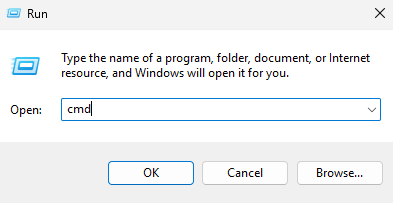
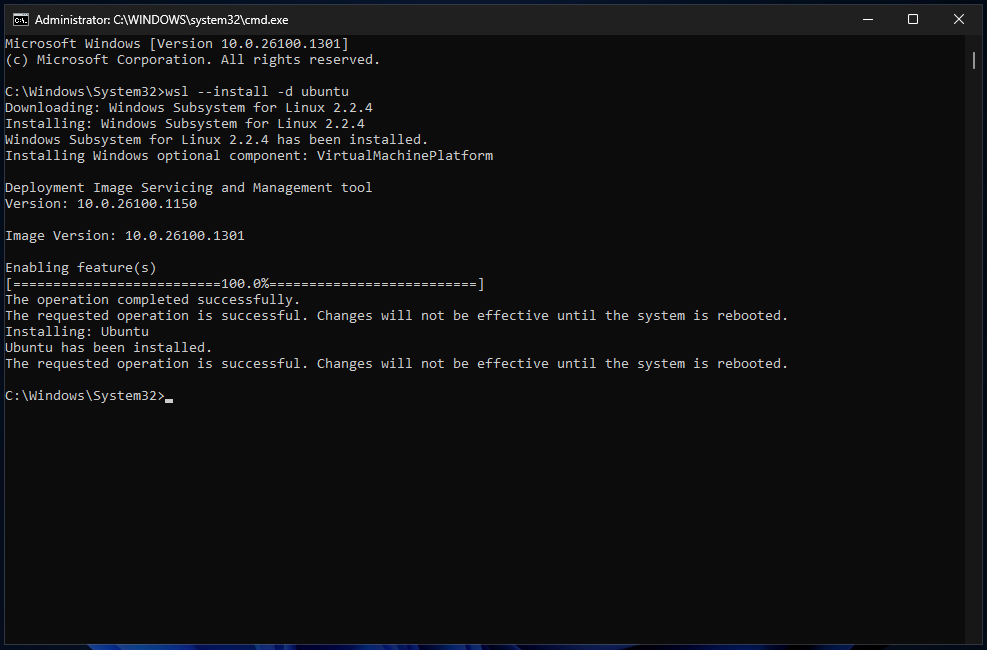
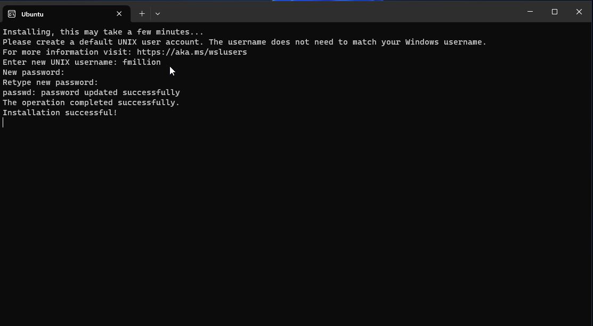
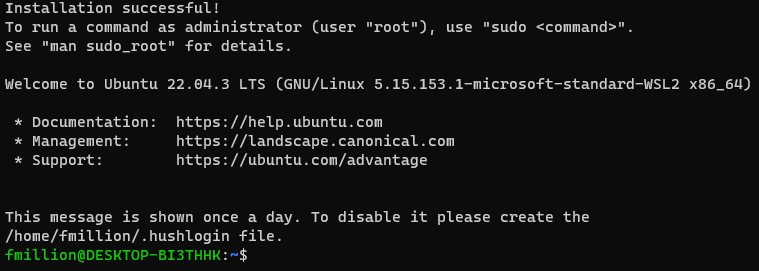

# Installing Linux on Windows systems using WSL

This process is quite straightforward and requires only a few steps.

> Caveats:
>
> * If you are using a virtualization system for another class, such as VMware Workstation or VirtualBox, those programs may or may not need some configuration changes after installing WSL. In particular, WSL enables the Windows Hypervisor platform; other virtualization programs must then use the HVP rather than their own engine. This should be automatic, but if you have trouble you can ask me for help.
> * Installing WSL won't take much room, but there are some potential issues with growing disk space usage. A process known as *compacting* can be used to recover disk space if the WSL image gets too large. See later in this document for details.

1. Bring up the Run dialog box by pressing Windows+R. Enter `cmd` into the box, then press **Ctrl+Shift+Enter**.

   

   > As an alternative, you can look for Command Prompt in your Start menu, and then hold down **Ctrl** and **Shift** while clicking on it.

2. Approve the authentication request.

3. Type `wsl --install -d ubuntu` and press Enter. The process will take some time to install and configure WSL. 

   You will see several messages coming from the WSL installation program in the terminal:

   

   If you see the message "Changes will not be effective until the system is rebooted", then restart your computer after the installation has finished (when the `C:...>` prompt reappears).

4. After WSL installation completes, you may be directly brought into the Linux environment and prompted for a UNIX username. **If this does not happen, manually launch Ubuntu by opening your Start Menu and launching "Ubuntu" from there.** 

   Provide a username for your Linux installation. This can be, but *does not need to be*, the same as your normal PC username. Remember what this username is.

   You'll then be asked for a    password. This is the password you will use under Linux to get administrative (root) access. Make sure you make note of the password! If you forget it, you either must do some advanced administrative steps to revert/reset the password, or you must completely erase your WSL instance and start over.

   
  
5. You'll finally be dropped to a Linux prompt - it ends with a `$`. Congratulations! Type `exit` to close WSL.

   

You're now all set. WSL should have added a profile for you under Windows Terminal if you have it. Otherwise you can always get to a WSL prompt by looking for Ubuntu in your Start menu.

## Usage Hints

### Accessing Windows files on Linux (and vice versa)

In Linux, you can access files on your Windows machine by using the directory `/mnt/c`. This will give you access to all files on your C: drive.

You can also access the Linux files from Windows by opening a Run dialog box and entering the following: `\\wsl$\` You will see the entire Linux filesystem. We will explore the Linux filesystem more in class.

### GPUs

It isn't particularly relevant for this course, but it is good to know that you can access nVidia GPUs from within WSL. This means that if you have an nVidia GPU in your computer, applications running on Linux can have direct access to it for tasks such as artificial intelligence training. This only currently works for nVidia GPUs, but work on AMD GPUs should be ongoing.

## Compacting

TODO: write this
